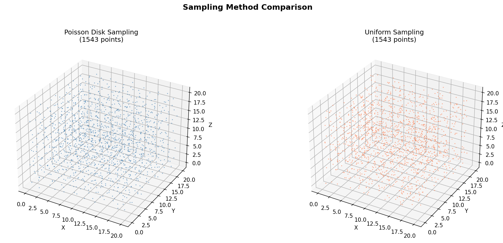
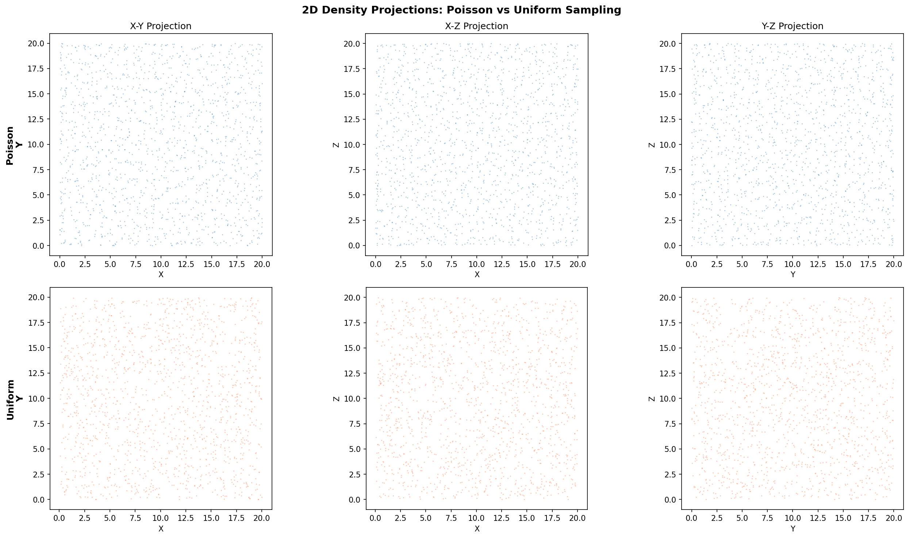
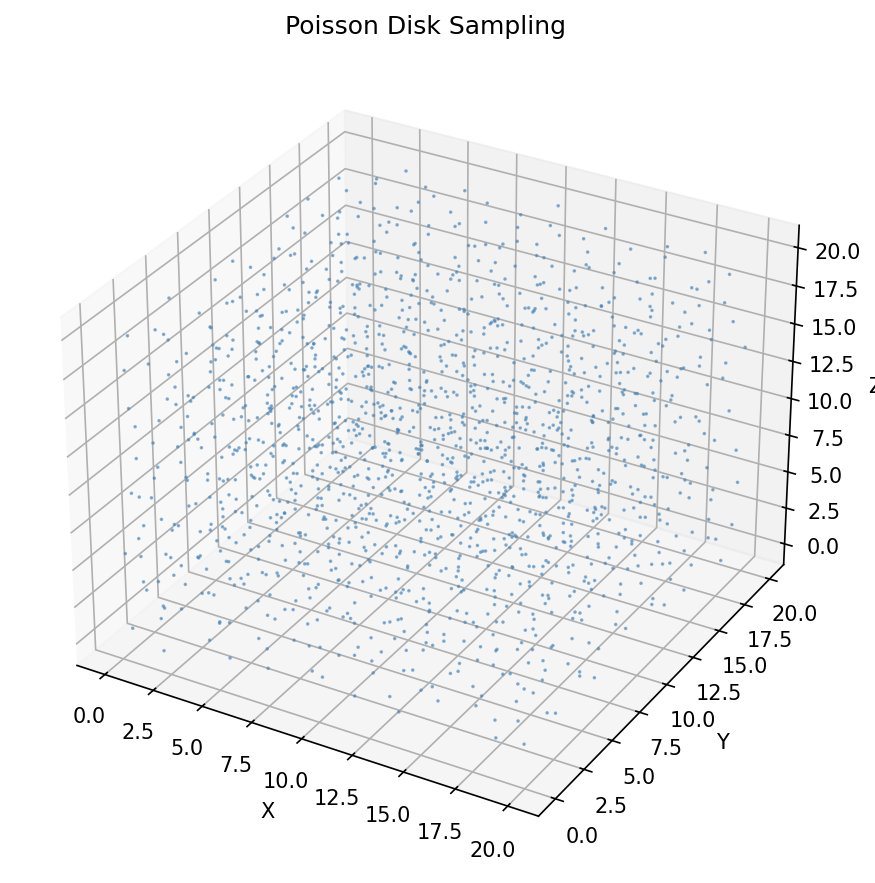
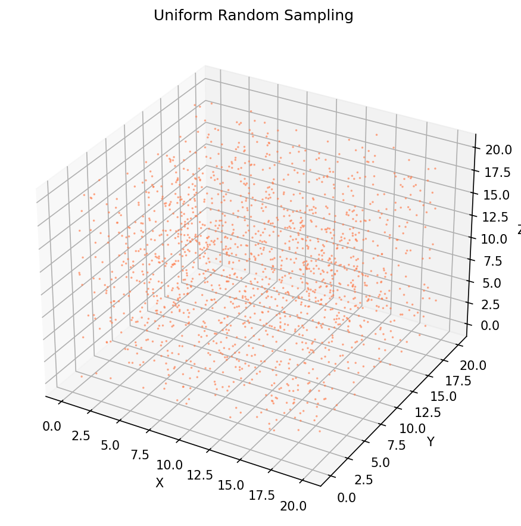

# Point Cloud Sampling

<p align="center">
  
</p>

<p align="center">
  <a href="https://github.com/sumeshthakr/PointCloudSampling/releases"></a>
  <a href="LICENSE"></a>
  
</p>

A high-performance Python package for 3D point cloud sampling, implementing **Poisson Disk Sampling** and **Uniform Sampling** with built-in visualization tools.

**Now optimized with Numba!** 🚀

---

## Features

- **Poisson Disk Sampling** – Generates points with a minimum distance constraint using Bridson's algorithm, optimized with `numba` JIT compilation for **~140x speedup** over pure Python.
- **Uniform Sampling** – Generates points uniformly distributed within a 3D bounding box.
- **Visualization** – Built-in 3D visualization and side-by-side comparison plotting using Matplotlib.

## Sampling Comparison

The key difference between the two sampling methods is how points are distributed in space:

- **Poisson Disk Sampling** enforces a minimum distance between points, producing an even, blue-noise distribution with no clusters or gaps.
- **Uniform Sampling** places points independently at random, which can result in clusters and voids.

### Side-by-Side 3D Comparison

<p align="center">
  
</p>

### 2D Density Projections

Projecting the 3D points onto the XY, XZ, and YZ planes highlights the density differences:

<p align="center">
  
</p>

### Individual Sampling Results

| Poisson Disk Sampling | Uniform Sampling |
| :---: | :---: |
|  |  |

## Performance

Benchmark results for generating ~22,000 points in a 50 × 50 × 50 volume with r=1.5:

| Implementation | Time (avg) | Points/sec |
| :--- | :--- | :--- |
| Pure Python (Previous) | ~27.0 s | ~800 |
| **Numba Optimized** | **0.19 s** | **~118,000** |

## Installation

This package requires Python 3.8+ and `numba`.

### From PyPI (Coming Soon)

```bash
pip install point-cloud-sampling
```

### From Source

```bash
# Clone the repository
git clone https://github.com/sumeshthakr/PointCloudSampling.git
cd PointCloudSampling

# Create a virtual environment (recommended)
python3 -m venv .venv
source .venv/bin/activate

# Install dependencies (includes numba)
pip install .
```

## Usage

### Poisson Disk Sampling

Poisson Disk Sampling is ideal for generating blue-noise sample patterns where every point is at least a distance `r` from all others.

```python
from point_cloud_sampling import PoissonSampler, plot_samples

# Initialize sampler
sampler = PoissonSampler(max_attempts=30, radius=1.5, max_x=10, max_y=10, max_z=10)

# Generate samples (first run compiles with Numba)
points = sampler.sample()
print(f"Generated {len(points)} points.")

# Visualize
plot_samples(points, title="Poisson Disk Sampling")
```

### Uniform Sampling

```python
from point_cloud_sampling import UniformSampler, plot_samples

# Generate 500 uniformly distributed points
points = UniformSampler.sample(
    n_points=500,
    x_range=(0, 10),
    y_range=(0, 10),
    z_range=(0, 10)
)

plot_samples(points, title="Uniform Sampling", color="coral")
```

### Comparing Sampling Methods

```python
from point_cloud_sampling import PoissonSampler, UniformSampler, plot_comparison

poisson = PoissonSampler(max_attempts=30, radius=1.5, max_x=20, max_y=20, max_z=20)
poisson_points = poisson.sample()

uniform_points = UniformSampler.sample(
    n_points=len(poisson_points),
    x_range=(0, 20), y_range=(0, 20), z_range=(0, 20)
)

# Side-by-side 3D comparison
plot_comparison(poisson_points, uniform_points)
```

## API Reference

| Function / Class | Description |
| :--- | :--- |
| `PoissonSampler(max_attempts, radius, max_x, max_y, max_z)` | Poisson Disk Sampler using Bridson's algorithm |
| `UniformSampler.sample(n_points, x_range, y_range, z_range)` | Uniform random sampler (static method) |
| `plot_samples(samples, title, color, marker_size, save_path)` | Visualize a single point cloud in 3D |
| `plot_comparison(poisson_samples, uniform_samples, save_path)` | Side-by-side 3D comparison plot |
| `plot_density_comparison(poisson_samples, uniform_samples, save_path)` | 2D density projection comparison |

## Future Plans

- **Parallelization** – Parallel processing for faster generation on multi-core CPUs.
- **GPU Support** – CUDA support using `numba.cuda` for massive point cloud generation.
- **More Shapes** – Sampling within spheres, cylinders, and custom meshes.
- **Blue Noise Analysis** – Tools to analyze spectral properties of generated samples.
- **Export Formats** – Support for `.ply`, `.xyz`, and `.pcd` file formats.

## Changelog

See [CHANGELOG.md](CHANGELOG.md) for a detailed history of changes.

## License

MIT License. See [LICENSE](LICENSE) for details.
